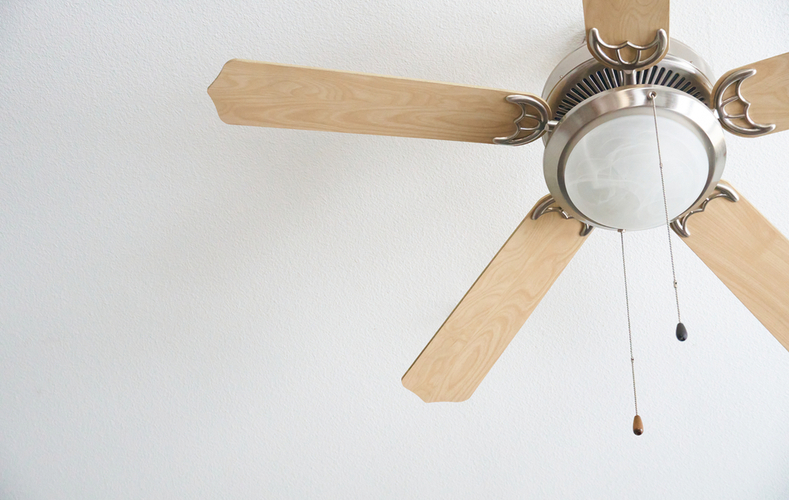
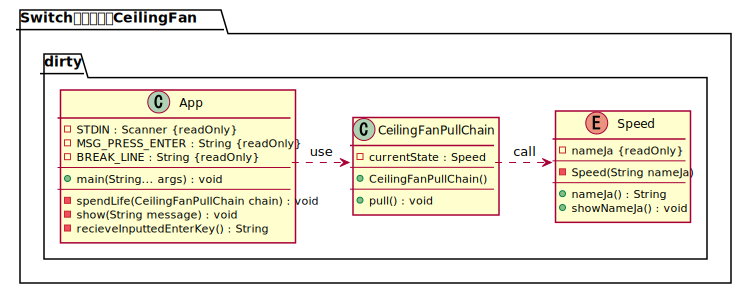
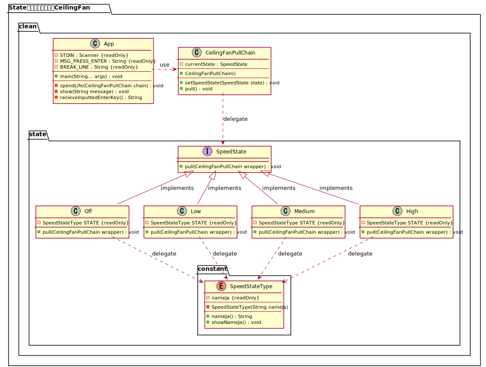

## State パターンの例

### 3つのスピードで変化するシーリングファン（天井扇風機）の状態遷移

シーリングファン（天井扇風機）の状態遷移を例にした State パターンのサンプルコード

<br />

`シーリングファン（天井扇風機）`


同じ状態遷移を単純にコードに書いた場合と、
State パターンでクラス設計を行った場合の比較をする。

1. 単純な状態遷移
2. State パターンでクラス設計を行った状態遷移

<br />

## 1. 単純な状態遷移

### 1. 単純な状態遷移: クラス図



Swich 文を使って単純に状態遷移を扱っている。
小さなプログラムでは、これで十分に状態を管理できる。

<br />

### 1. 単純な状態遷移: コード抜粋
``` java
package dirty;

public enum Speed {

    LOW_SPEED("低速"), MEDIUM_SPEED("中速"), HIGH_SPEED("高速"), TURNING_OFF("停止"),;

    private final String nameJa;

    private Speed(String nameJa) {
        this.nameJa = nameJa;
    }

    public String nameJa() {
        return this.nameJa;
    }

    public void showNameJa() {
        System.out.println(this.nameJa);
    }
}
```

``` java
package dirty;

public class CeilingFanPullChain {

    private Speed currentState;

    public CeilingFanPullChain() {
        this.currentState = Speed.TURNING_OFF;
    }

    public void pull() {
        switch (this.currentState) {
            case TURNING_OFF:
                currentState = Speed.LOW_SPEED;
                break;
            case LOW_SPEED:
                currentState = Speed.MEDIUM_SPEED;
                break;
            case MEDIUM_SPEED:
                currentState = Speed.HIGH_SPEED;
                break;
            default:
                currentState = Speed.TURNING_OFF;
                break;
        }
        this.currentState.showNameJa();
    }
}
```

<br />

## 2. State パターンでクラス設計を行った状態遷移

### 2. State パターンでクラス設計を行った状態遷移: クラス図


大規模なプログラムでは、状態をクラスで分割すると管理がしやすくなる。
クラスで分割する際に、インタフェースで型定義しておくとさらに管理がしやすくなる。
小さなプログラムで、このような State パターンを使うのは過剰となる。

<br />

### 2. State パターンでクラス設計を行った状態遷移: コード抜粋

``` java
package clean.state;

import clean.CeilingFanPullChain;

public interface SpeedState {

    void pull(CeilingFanPullChain wrapper);
}
```

``` java
package clean.state;

import clean.CeilingFanPullChain;
import clean.state.constant.SpeedStateType;

public class Off implements SpeedState {
    public static final SpeedStateType STATE = SpeedStateType.OFF;

    @Override
    public void pull(CeilingFanPullChain wrapper) {
        wrapper.setSpeedState(new Low());
        STATE.showNameJa();
    }
}
```